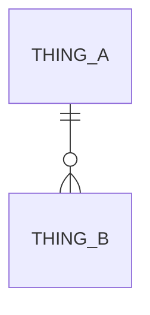

# Business Language (Vocab)

## Things (nouns)
| Term | Meaning | Banned synonyms |
|---|---|---|
| **<Noun>** | <one line — what it is in the business, not in code> | <alternate>, <alternate> |

## Actions (verbs)
| Verb | Meaning | Banned synonyms |
|---|---|---|
| **<verb>** | <one line — the state change it causes, on which **<Noun>**> | <alternate>, <alternate> |

## Relationships
| From | Relationship | To | Note |
|---|---|---|---|
| **<Thing>** | owns / has-many / references | **<Thing>** | <one line> |

**Lifecycles**:
- **<Thing>**: <stateA> → <stateB> — **<verb>** triggers the transition.
- **<Thing>**: <stateA> → <stateB> → <terminal state> — <trigger per hop>.

## The business
Every term in **bold** must appear in the tables above.

- **<StageA>** — <one sentence describing the core loop, canonical terms only>.
- **<StageB>** — <one sentence>.
- **<StageC>** — <one sentence>.

## Open naming decisions
- <term X vs term Y — which is canonical? Awaiting USER confirmation>
- <noun used as both an entity and an enum value — needs disambiguation>
