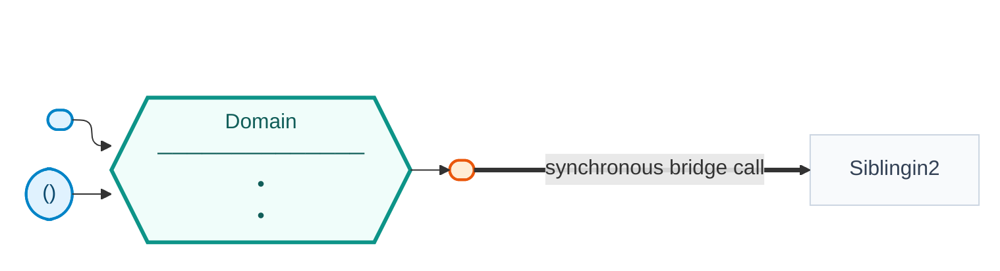

# Shared mermaid port diagram — conventions

The diagram is **one system-wide asset** at `docs/mermaid.md`. Every `domain-spec` run **amends it in
place**: add or refresh this domain's subgraph and any bridge edges. Never produce a per-domain copy.

## Model to diagram mapping

| Model-sketch artifact | Diagram element |
|---|---|
| Bounded context | a `subgraph` |
| Aggregate root + value objects | the hexagon core `{{...}}` |
| `INBOUND: driving` port | inbound stadium node → core |
| `INBOUND: sibling` port | separate inbound stadium node → core |
| `OUTBOUND` port | outbound stadium node, core → node |
| Cross-domain **bridge** | thick edge: caller's outbound port `==>` callee's inbound port |

## Shape & palette template

- Each domain core (`X_Core`) should use a distinct hue (teal / indigo / amber, etc.) so domains read apart visually.
- Prefix ids per domain (e.g. `X`/`O`/`A`) so they never collide.
