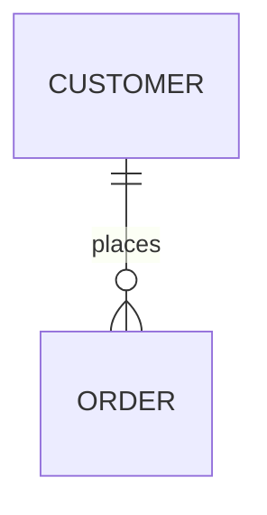

# Establish Vocabulary v2

Take raw business requirements and produce `docs/vocab.md` to establish the common business vocabulary before any domain modelling begins.

## Principles (The Taste)
- **Consistent, Concise, & Code-ready:** The vocabulary MUST be strictly consistent and concise, as it serves as the direct foundation for downstream domain modelling and code generation.
- **One word per concept, no synonyms:** Pick the canonical noun/verb and ban alternates (e.g. say "lock", never "hold").
- **One concept per word (no homonyms):** Disambiguate if a noun is used for both an entity and a type/enum value.
- **Common over clever:** Prefer standard industry terminology.
- **Separate Things (nouns) and Actions (verbs):** Actions are state-changing operations on Things.
- **Relationships are first-class:** Map them explicitly (owns, has-many, references).
- **Describe the business:** Tell the core loop using *only* these words, all in **bold**.

## Process
1. Read requirements and extract nouns/verbs.
2. Canonicalise terms and collapse synonyms.
3. Map relationships and lifecycles.
4. Describe the business loop using the vocabulary.
5. Surface any open naming decisions.
6. Write `docs/vocab.md` using the template.

## Output Template (`docs/vocab.md`)

```markdown
# Business Vocabulary

## Things (nouns)
| Term | Meaning | Banned synonyms |
|---|---|---|
| **<Noun>** | <one line> | <banned> |

## Actions (verbs)
| Verb | Meaning | Banned synonyms |
|---|---|---|
| **<verb>** | <one line> | <banned> |

## Relationships
| From | Relationship | To | Note |
|---|---|---|---|
| **<Thing>** | owns / references | **<Thing>** | <one line> |



**Lifecycles**:
- **<Thing>**: <stateA> → <stateB> — <verb that triggers transition>.

## The business
- **<StageA>** — <one sentence, every term in bold>.

## Open naming decisions
- <ambiguities to confirm>
```

## Hand-off
`docs/vocab.md` is the canonical input to `hex-domain`.
**CRITICAL:** Do NOT proactively update domain models or code. Only update `docs/vocab.md`.
