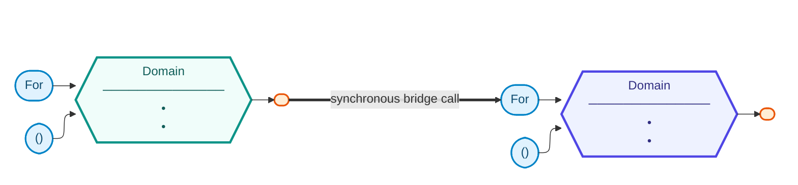

# System Port Diagram

> Conventions: `mermaid-diagram.md` in the `hex-domain` skill.

## Domains in this diagram
| Domain | Id prefix | Core hue | Sketch |
|---|---|---|---|
| <DomainX> | `X` | teal | `<domainx>.md` |
| <DomainO> | `O` | indigo | `<domaino>.md` |

## Bridges
| From (outbound port) | To (inbound port) | Purpose |
|---|---|---|
| `<DomainX>.<OutboundPort>` | `<DomainO>.<DomainO>For<DomainX>` | <one line> |
